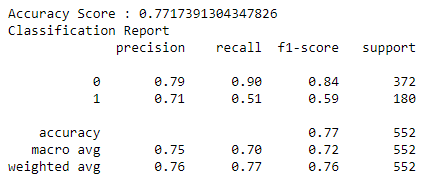

# Team Children of Jupyter Final Project
Group 1 Final Project: Data Analytics Boot Camp

## Project Outline

### Selected Topic and Rationale
We will be using machine learning to create a model that predicts which passengers survived the Titanic shipwreck. Our team selected this topic because we wanted to obtain a deeper understanding of the tragedy and how different passenger attributes impacted their odds of survival.
### Data Source
Our resources will come from the dataset contained in the ["stablelearner" r-package](https://search.r-project.org/CRAN/refmans/DALEX/html/titanic.html#:~:text=According%20to%20the%20website%201317,for%20a%20few%20regular%20passengers.) and stored as [CSV files](Resources/titanic.csv).

### Technologies Used
The project is broken into component pieces below. 

* <strong>[Database Storage](#importing-titaniccsv-into-pgadmin)</strong>: We used a local instance of pgAdmin (PostgresSQL) to store [a backup file](Resources/titanic_project_db_backup.sql) of the database that project members can download and restore on their local machines. Users are encouraged to use the [create_database](Notebooks/create_database.ipynb) script in Jupyter Notebook to this end ([see steps below](#importing-titaniccsv-into-pgadmin))
* <strong>[Machine Learning](#running-machine-learning-model)</strong>: We used a [decision tree model](Notebooks/Titanic-decision-tree.ipynb) 
* <strong>Statistical Analyses</strong>: [RStudio](webapp/webapp/templates/Routput.html)
* <strong>Interactive Dashboard</strong>: [Tableau](https://public.tableau.com/views/FinalProjectChildrenofJupyter/Story2?:language=en-US&:display_count=n&:origin=viz_share_link) 
* <strong>[Website](#flask-running-the-application-locally)</strong>: Flask with API routes that render across Python, HTML and JavaScript (see usage details below)
* <strong>Presentation</strong>: PowerPoint; [presentation](Titanic.pptx)

### Questions We Hope to Answer
We will run statistical analysis to see how different groups fared based on factors such as age, gender, socio-economic status, etc. We are hoping to add a section of our dashboard that allows users to input their own information and generate their probability of survival.

### Importing titanic.csv into PgAdmin
* Create a database named ```titanic_project``` and ensure it is selected with an active connection. 
* Add a ```config.py``` file to your Notebooks folder in the group repo. (The file is otherwise hidden in .gitignore.) It should read:
    ```
    db_password = '[insert your password here]'
    ```
* Open a command line terminal in this same Notebooks folder and run ```jupyter notebook```
* Open the ```create_database.ipynb``` file and execute the four cells.
  * The script will create 2 different tables: passenger_registry and embarked.

* Refresh your database. You should see both new tables ```passenger_registry``` and ```embarked```
    * To confirm the data imported properly, run the following query: 
        ```
        select * from passenger_registry where country='United States';
        ```
        You should see 264 records returned. 
    
### Running Machine Learning Model

* <strong>First</strong>, we cleaned the data and ensured it was ready for entry into the model
* <strong>Next</strong>, we set up the machine learning model
  * 
* <strong>Then</strong>, we fit the model using the decision tree method
  * 
* <strong>After That</strong>, we ran the model and arrived at the following conclusions:
  * 
- Precision (True Positives divided by sum of True and False Positives): <strong>79%</strong>
- Recall (True Positives divided by sum of True Postivies and False Negatives): <strong>90%</strong>
- The Recall score is higher than precision, meaning our model is most likely to be incorrect when it rules out False Negative predictions. This means it's not as likely that the model would predict survival in an instance when the person actually would not survive.

  * 
* <strong>Finally</strong>, we saved the scaler to a file using the dependency <strong>pickle</strong>
### Flask: Running the application locally
* Ensure that your development environment is active with
    ```
    conda activate [development-environment-name]
    ```
* If you haven't already, install Flask with the following command
    ```
    pip install flask
    ```
* For additional dependencies, see the [requirements.txt](webapp/requirements.txt) file.
* Navigate to the /webapp folder of the repo. Run the following command:
    ```
    flask run
    ```

    or

    ```
    python app.py
    ```

    The app should open on a localhost (likely http://127.0.0.1:5000/). Copy this address into your browser and enjoy!
    
* When you finish using the app, you can run ```Ctrl + C``` in the terminal to end the local connection. 